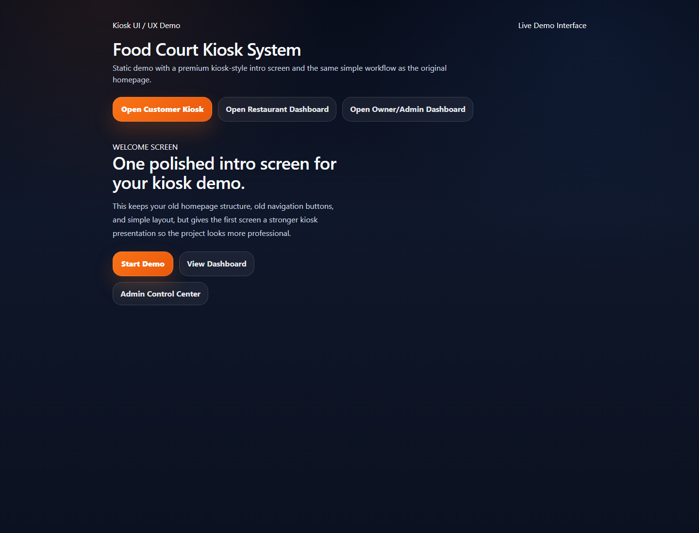
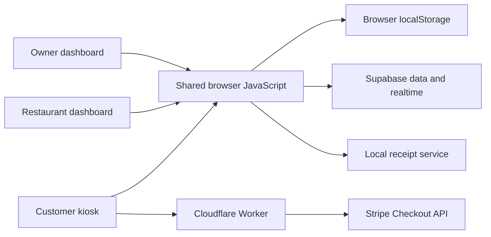

# Food Court Kiosk

A final-year project that brings customer ordering, restaurant operations, and owner reporting into one browser-based food court system.

Customers choose food and track an order; restaurant staff manage the queue; the owner views activity and reports.



*Homepage captured from the local source in Edge. This is a UI preview, not evidence of a completed order or payment.*

## Explore

| Screen | Purpose |
| --- | --- |
| [Home](index.html) | Entry point for customer and staff screens |
| [Customer kiosk](kiosk.html) | Menus, cart, service selection, and checkout |
| [Restaurant dashboard](restaurant.html) | Order approval, preparation status, and menu availability |
| [Owner dashboard](admin.html) | Analytics, administration, advertisements, and spreadsheet exports |
| [Order tracking](order-track.html) | Customer-facing order status |
| [Hardware console](hardware.html) | Device status and integration controls |

## Architecture



The frontend uses HTML, CSS, JavaScript, and Tailwind's CDN script. Shared storage code combines local browser state with Supabase integration. The Worker serves assets and provides Stripe endpoints. Receipt printing also has a client for a separate service on `127.0.0.1:5001`.

## Preview locally

From the repository root, with Python installed:

```bash
python -m http.server 8000
```

Open **http://localhost:8000**. Serving over HTTP allows the frontend to load JSON resources.

This previews the frontend. Python's static server does **not** execute `src/worker.js`, so it cannot handle Stripe checkout routes. The frontend points to the Supabase project configured in `assets/supabaseclient.js`; a local preview is not an isolated backend.

## Connected services

| Component | Configuration | Requirement |
| --- | --- | --- |
| Supabase | `assets/supabaseclient.js`, `assets/storage.js` | Database, access policies, and realtime setup |
| Stripe | `src/worker.js` | Worker secret `STRIPE_SECRET_KEY` and a suitable test environment |
| Worker | `wrangler.jsonc` | Cloudflare tooling/account; review `SITE_URL` and `STRIPE_CURRENCY` |
| Printer | `assets/app.js` | Separate service exposing `POST /api/print-receipt` on port 5001 |

The repository has no database migration/schema files or receipt-service implementation. A fresh clone is enough to inspect the frontend, but not enough to reproduce every connected workflow.

Worker routes:

- `POST /api/stripe/create-checkout-session`
- `GET /api/stripe/session`

## Demonstration walkthrough

1. Open the customer kiosk and choose a restaurant.
2. Add menu items and choose the service option.
3. Follow the order in the restaurant dashboard.
4. Exercise checkout in a configured test environment.
5. Update preparation status and inspect the tracking screen.
6. Review the owner dashboard and export a report.

These are intended demonstration steps, not an end-to-end test result from this documentation update.

## Source map

```text
assets/          Styles, application logic, and images
data/            JSON data used by the frontend
src/worker.js    Asset serving and Stripe endpoints
*.html           Customer, staff, and device screens
wrangler.jsonc   Worker configuration
```

## Current status

This is an academic prototype with connected-service code. The previous README described a localStorage-only static demo; that no longer matches the repository.

The payment endpoint currently accepts an order total from the browser. Server-side price calculation and authorization need review before production use. Database policies, payment execution, and physical printer behavior were not validated during this documentation work.

## Feedback

Open an issue with the page, steps, and expected behavior. Screenshots and browser-console errors help explain UI problems.
